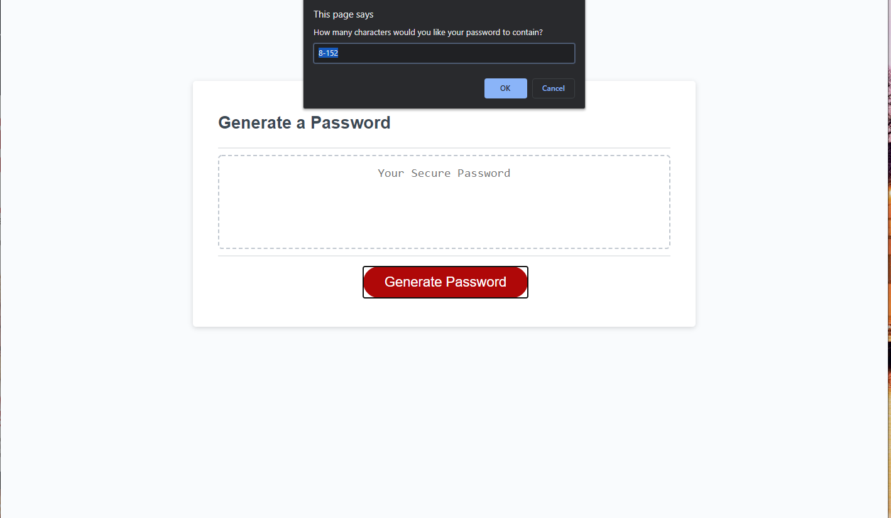

#Random Password Generator

#Purpose
Using various javaScript elements, I created a random password generator that follows criteria selected by the user.
To acheive this, I created various confirm messages that cause a varible to update via if() statments.
In addtion, the four criteria arrays are stored as const strings that will randomize and genereate a password in the box displayed.

#Usage
To use this, enter the URl <a href="https://perkyderm.github.io/PasswordGenerator/">here</a> into a browser. Enter the amount of characters desired and click OK. Next, confirm or cancel the messages you desire. If you entered correct criteria, the system will display a random set of characters. Enjoy!

